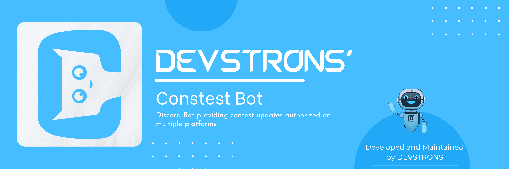

  

    <a href="https://github.com/devstrons/contest-bot/blob/master/LICENSE" target="_blank">
      
         
    
  

 

## 🧰 Testing

- `npm install` — Installs all dependencies.
- `node index.js` — To run the Discord bot.

## ⚡ Guidelines to follow

Wanna contribute to our project, but don't know how to start? :balloon:  
Check out our [contributing guidelines]() for how to make your first contribution here.

## 📰 License

> The **devstrons' contest bot** project is released under the [GNU General Public License v3.0](https://github.com/devstrons/contest-bot/blob/main/LICENSE).   Developed &amp; maintained By the DEVSTRONS' Community. Copyright 2021 © DEVSTRONS.

> **YouTube** <a href="https://www.youtube.com/channel/UCG7JT7yqut81fqFsVBX6oMg" target="_blank" rel="noopener">@devstrons</a> &nbsp;&middot;&nbsp;
> **Instagram** <a href="https://www.instagram.com/devstrons" target="_blank" rel="noopener">@devstrons</a> &nbsp;&middot;&nbsp;
> **Discord** <a href="https://discord.com/invite/MVujzTBqed" target="_blank" rel="noopener">DEVSTR😊NS'</a> &nbsp;&middot;&nbsp;
> **Twitter** <a href="https://twitter.com/devstrons" target="_blank" rel="noopener">@devstrons</a>
